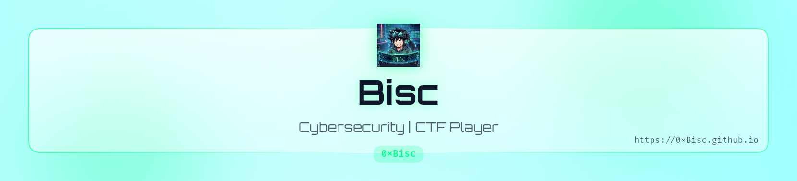
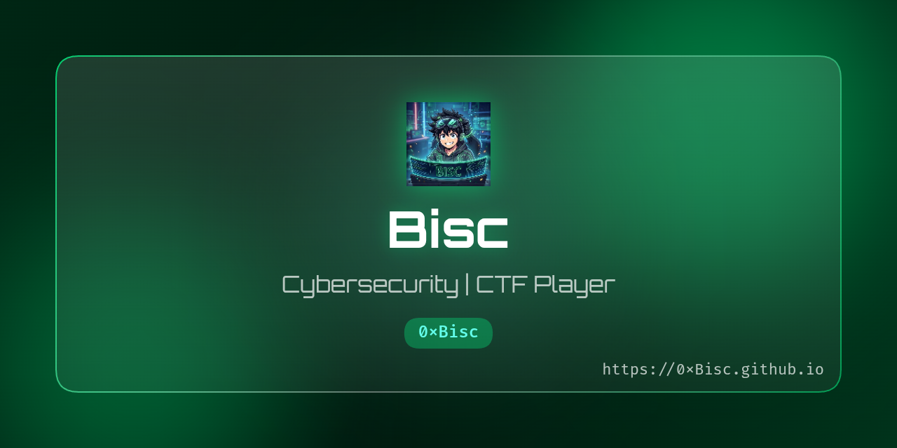

<!--
╔══════════════════════════════════════════════════════════════════════════════╗
║                           0xBISC // PROFILE                                  ║
║                    CYBERSECURITY • CTF • PENTESTING                          ║
╚══════════════════════════════════════════════════════════════════════════════╝
-->

<div align="center">

<picture>
  <source media="(prefers-color-scheme: dark)" srcset="art/header-dark.png">
  
</picture>


<br>

<p style="display: flex; align-items: center; justify-content: center; font-family: 'JetBrains Mono', monospace; font-size: 18px; color: #00FF88;">
  <span>&gt;&nbsp;</span>
  
</p>

<br>

```text
┌──────────────────────────────────────────────────────────────────────┐
│  USER       ::  0xBisc                                               │
│  ALIAS      ::  Bisc                                                 │
│  ROLE       ::  Cybersecurity / Pentesting Enthusiast / CTF Player   │
│  STATUS     ::  [ ONLINE ]                                           │
│  OBJECTIVE  ::  Learn • Break • Build • Secure                       │
└──────────────────────────────────────────────────────────────────────┘
```

<a href="https://0xBisc.github.io">
  
</a>
<a href="https://tryhackme.com/p/Bisc">
  
</a>

<br/>


</div>

---

## `// whoami`

<div align="center">

```text
╔════════════════════════════════════════════════╗
║                                                ║
║   ██████╗ ██╗  ██╗██████╗ ██╗███████╗ ██████╗  ║
║  ██╔═████╗╚██╗██╔╝██╔══██╗██║██╔════╝██╔════╝  ║
║  ██║██╔██║ ╚███╔╝ ██████╔╝██║███████╗██║       ║
║  ████╔╝██║ ██╔██╗ ██╔══██╗██║╚════██║██║       ║
║  ╚██████╔╝██╔╝ ██╗██████╔╝██║███████║╚██████╗  ║
║   ╚═════╝ ╚═╝  ╚═╝╚═════╝ ╚═╝╚══════╝ ╚═════╝  ║
║                                                ║
║          [ CYBERSPACE NODE // 0xBISC ]         ║
╚════════════════════════════════════════════════╝
```

</div>

```bash
┌──(0xBisc㉿cyberspace)-[~]
└─$ whoami
0xBisc

[+] Identity      : Bisc
[+] Handle        : 0xBisc
[+] Role          : Cybersecurity Enthusiast
[+] Specialty     : Pentesting / CTF
[+] Environment   : Linux
[+] Status        : ONLINE
[+] Mindset       : BREAK → UNDERSTAND → SECURE

┌──(0xBisc㉿cyberspace)-[~]
└─$ cat /etc/profile
Cybersecurity enthusiast focused on:
→ Offensive security
→ Penetration testing
→ Capture The Flag
→ Linux & networking
→ Security tooling
→ Continuous learning
```

> 🧠 **Curiosity is the exploit. Knowledge is the payload.**

<br>

I'm **Bisc**, a cybersecurity learner from 🇯🇴 exploring the offensive side of security, solving CTF challenges, building labs, and continuously sharpening my technical skills.
> **"I love biscuits 🙃🍪"**

My goal is simple:

```text
Understand the system.
Break the assumptions.
Find the weakness.
Learn how to secure it.
```

---

## `~/arsenal`

<div align="center">

### `OPERATING SYSTEMS`


<br>
    [Linux]  [Kali Linux]

### `Security`


### `Development`


</div>

---

## `// mission`

```text
[01] Improve offensive security skills
[02] Master web & network security
[03] Solve harder CTF challenges
[04] Build security-focused projects
[05] Keep learning. Never stop.
```

<div align="center">

`[ PENTESTING ]` ` [ CTF ]` ` [ WEB SECURITY ]` ` [ NETWORKING ]` ` [ LINUX ]`

</div>

---

## `~/tryhackme`

<div align="center">

<a href="https://tryhackme.com/p/Bisc">
  
</a>

</div>

<br/>

```text
╔══════════════════════════════════════╗
║          TRYHACKME NODE              ║
╠══════════════════════════════════════╣
║                                      ║
║   USER       :: Bisc                 ║
║   RANK       :: [0x6][VOYAGER]       ║
║   PLATFORM   :: TryHackMe            ║
║   STATUS     :: TRAINING             ║
║                                      ║
╚══════════════════════════════════════╝
```

</div>

---

# `// TERMINAL`

```bash
┌──(0xBisc㉿kali)-[~/cybersecurity]
└─$ cat philosophy.txt

Learn.
Break.
Understand.
Build.
Secure.

┌──(0xBisc㉿kali)-[~/cybersecurity]
└─$ ./next_challenge.sh

[+] Challenge accepted.
[+] Let's hack the knowledge gap.
```

---

<div align="center">



</div>

---

## `// current_focus`

```text
╔══════════════════════════════════════════════════════════╗
║                   CURRENT FOCUS                          ║
╠══════════════════════════════════════════════════════════╣
║  > Cybersecurity                                         ║
║  > Penetration Testing                                   ║
║  > CTF / Problem Solving                                 ║
║  > Web Security                                          ║
║  > Linux                                                 ║
║  > Networking                                            ║
║  > Python / Bash                                         ║
╚══════════════════════════════════════════════════════════╝
```

---

## `~/links`

<div align="center">

<a href="https://github.com/0xBisc">

</a>

<a href="https://tryhackme.com/p/Bisc">

</a>

<a href="https://0xBisc.github.io">

</a>

</div>

---

<div align="center">

```text
┌─────────────────────────────────────────────┐
│                                             │
│   "The quieter you become,                  │
│    the more you can hear."                  │
│                                             │
│                 — 0xBisc                    │
│                                             │
└─────────────────────────────────────────────┘
```

### `> connection terminated...`


**`I love biscuits 🙃🍪`**

</div>
